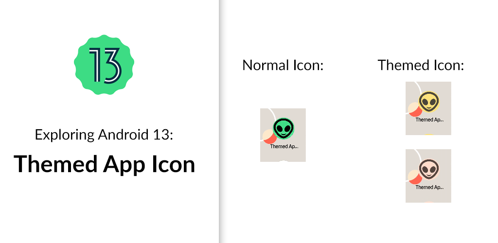
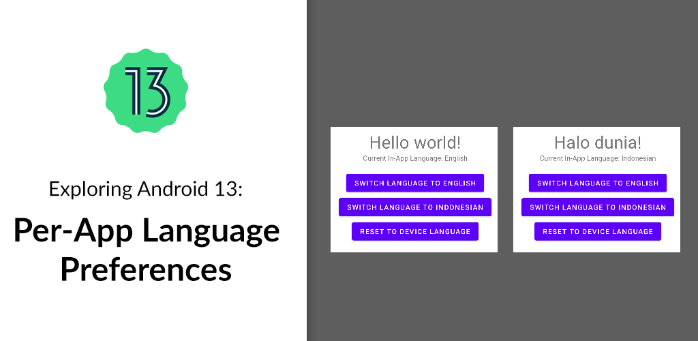
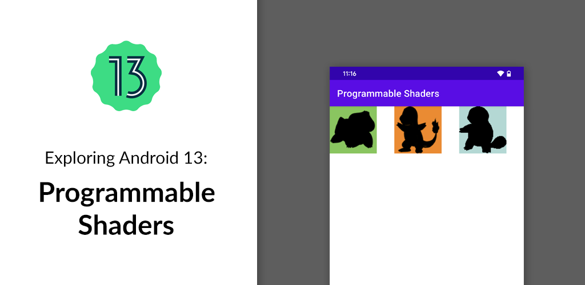

# android-13-samples

Sample projects for Android 13 (Developer Preview 2).

## Table of Content

| | |
| :-: | :-: |
| Themed App Icon ([Github](/themed-app-icon)) ([Tutorial](https://yggr.medium.com/exploring-android-13-quick-settings-placement-api-b3154da48668)) | Quick Settings Placement API ([Github](/quick-settings)) ([Tutorial](https://yggr.medium.com/exploring-android-13-quick-settings-placement-api-b3154da48668)) |
|  |  |
| Per-App Language Preferences ([Github](/per-app-language-preferences)) ([Tutorial](https://yggr.medium.com/exploring-android-13-per-app-language-preferences-f08a16e76657)) | Photo Picker ([Github](/photo-picker)) ([Tutorial](https://yggr.medium.com/exploring-android-13-photo-picker-4cabb65364bd)) |
|  |  |
| Nearby Wi-Fi Devices Permission ([Github](/nearby-wifi-devices)) ([Tutorial](https://yggr.medium.com/exploring-android-13-nearby-wi-fi-devices-permission-7e1daa3610ba)) | Programmable Shaders ([Github](/programmable-shaders)) ([Tutorial](https://yggr.medium.com/exploring-android-13-programmable-shaders-db91683127e3)) |
|  |  |
